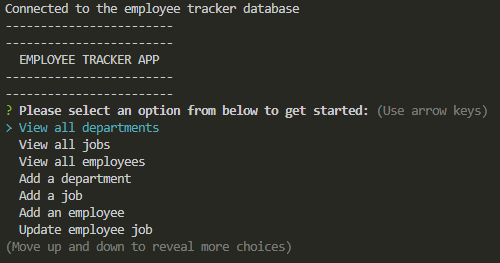
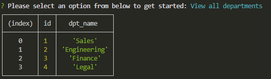
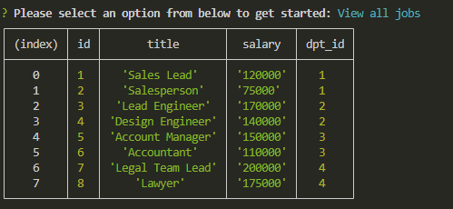
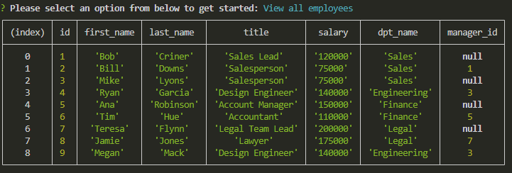
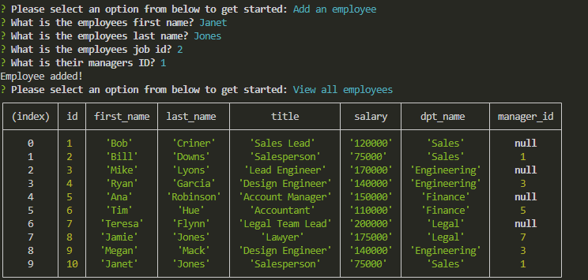
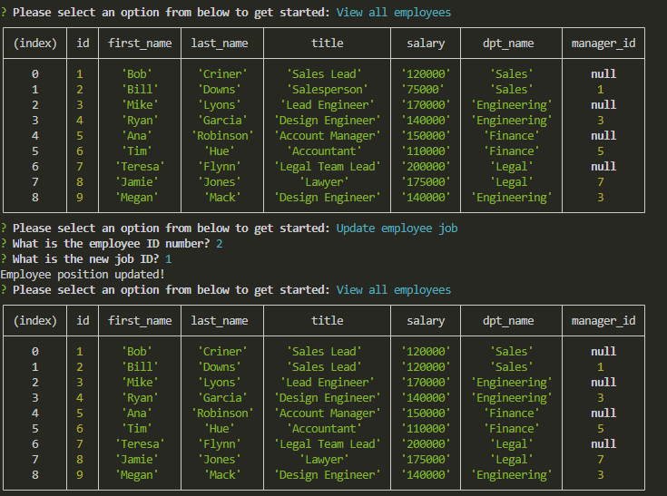

# SQL EMPLOYEE TRACKER

To develop an interface that allows an easy view and interaction with stored data information. This interface will be completed by using the command line application to manage the company database. 

## USER STORY 

* AS A business owner
* I WANT to be able to view and manage the departments, roles, and employees in my company
* SO THAT I can organize and plan my business

## ACCEPTANCE CRITERIA 

* GIVEN a command-line application that accepts user input
* WHEN I start the application
* THEN I am presented with the following options: view all departments, view all roles, view all employees, add a department, add a role, add an employee, and update an employee role
* WHEN I choose to view all departments
* THEN I am presented with a formatted table showing department names and department ids
* WHEN I choose to view all roles
* THEN I am presented with the job title, role id, the department that role belongs to, and the salary for that role
* WHEN I choose to view all employees
* THEN I am presented with a formatted table showing employee data, including employee ids, first names, last names, job titles, departments, salaries, and managers that the employees report to
* WHEN I choose to add a department
* THEN I am prompted to enter the name of the department and that department is added to the database
* WHEN I choose to add a role
* THEN I am prompted to enter the name, salary, and department for the role and that role is added to the database
* WHEN I choose to add an employee
* THEN I am prompted to enter the employee’s first name, last name, role, and manager, and that employee is added to the database
* WHEN I choose to update an employee role
* THEN I am prompted to select an employee to update and their new role and this information is updated in the database

## INSTALLATION 

User will need to install dotenv, express, inquirer, mysql2, and console table. To install go to terminal and do npm i to run all needed applications. 

### Required Modules / Packages:

* Inquirer Package
* Node.js
* mysql2 Package
* dotenv Package

## USAGE 

The following screenshots show examples of the interaction and options presented to the user when application is initiated. 

Initial prompt:

The image below shows al the departments added to the database:

This image shows all current jobs in the database:

Below shows a table of all employees and their applicable titles, salary, departments, and managers. 

Adding an employee example:

Updating an employee example:

Once the user is done making updates, they can select Cancel to end application: 

## LINKS 

Link to GitHub:

[GitHub Documentation](https://github.com/TrianaD/sql_employee_tracker)

Link to video example: 

[Video Example](https://drive.google.com/file/d/1c8mmJTa5n-4QLD-tBWQYyBhA6PrVMdXB/view)
